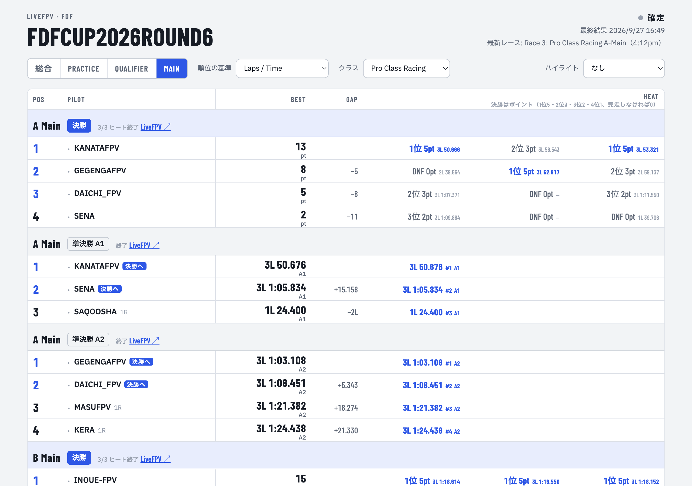

# FDF Cup Ranking Board

A live ranking board for [FDF Cup](https://fdf2784.livefpv.com/results/) FPV drone races, built on top of LiveFPV's race results and deployed as a Cloudflare Worker.

LiveFPV shows one ranking per round. This board pulls every round and heat and puts them on one page that works on a phone at the track:

- **Combined standings** — each pilot's best result across all Practice and Qualifier rounds, ranked by Laps/Time, Top 3 / Top 2 consecutive, or fastest lap
- **Lap times** — tap a pilot to see every lap of every heat, with the fastest lap and best 3 consecutive laps highlighted, linked to the LiveFPV heat page
- **False detections filtered** — laps under 12 s are treated as double gate detections and merged into the next lap
- **Mains** — semifinal heats with the top 2 advancing, and a 3-heat points final (5 / 3 / 2 / 1, DNF 0)
- **Permalinks** for each tab (`#all`, `#practice`, `#qualifier`, `#main`)

**Results: [FDFCUP 2026 Round 6](https://fdf-ranking-board.saqoosha.workers.dev/2026/round6/)**



## How it works

During an event the Worker scrapes LiveFPV's HTML (round rankings, heat pages, the Main Events heat sheet), caches the result at the edge, and serves `data.json` to a single static page that polls every 30 s. After the event the data is frozen into static files and served as an archive. Details: [docs/architecture.md](docs/architecture.md).

LiveFPV has no public API and changes shape during an event: mains get rebuilt, race ids get reused. What the scraper relies on and what went wrong is in [docs/livefpv.md](docs/livefpv.md).

## Running it

Two Wrangler configs, one Worker name:

| Config | Mode |
|---|---|
| `wrangler.toml` | Archive: serves `public/` as static assets. `/` redirects to the latest event |
| `wrangler.live.toml` | Live: scrapes LiveFPV, per-minute cron, KV for final heats |

```sh
npx wrangler deploy                          # archive (current)
npx wrangler deploy -c wrangler.live.toml    # live, during an event
```

Before, during and after an event: [docs/operations.md](docs/operations.md).

## Layout

```
src/index.js        live Worker: scraping, /data.json, /laps.json, cron
src/page.html       the board (the same file serves live and archive)
src/semis.json      semifinal results saved by hand after LiveFPV deleted them (Round 6 only)
public/<year>/<round>/   frozen events: index.html, data.json, laps/<race id>.json
public/_redirects   / -> latest event
```

The board UI is in Japanese.

## License

[MIT](LICENSE). Race results in `public/` and `src/semis.json` come from LiveFPV.
